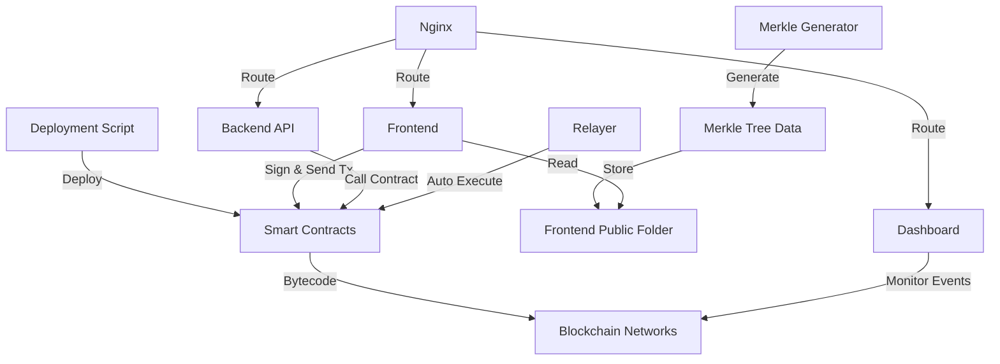

# พิมพ์เขียวโครงการ ZeaZDev Mini App (Project Blueprint)

**Version:** 2.0 - World App Mini App Edition  
**Developer:** PHIPHAT PHOEMSUK (ZeaZDev)  
**Website:** https://app.zeaz.dev/  
**Platform:** World App Mini App  
**License:** MIT

---

## 1. บทสรุปโครงการ (Project Overview)

### Mission Statement
ZeaZDev คือ World App Mini App ที่ใช้เทคโนโลยี Zero-Knowledge Proof (ZKP) ผ่าน World ID สำหรับการยืนยันตัวตน (Proof of Personhood) และให้บริการทางการเงินแบบ DeFi บน Blockchain โดยผู้ใช้จะได้รับรางวัลรายวัน, Airdrop และสามารถทำธุรกรรมแบบ Swap Token ได้อย่างปลอดภัยและไม่ต้องจ่าย Gas (Gasless Transactions)

### Problem Statement
ปัญหาหลักที่ ZeaZDev Mini App แก้ไข:
- **Sybil Attack ในระบบรางวัล:** ผู้ใช้สามารถสร้างหลาย Account เพื่อรับรางวัลซ้ำ ทำให้การแจกจ่ายไม่เป็นธรรม
- **ค่า Gas ที่สูง:** ผู้ใช้ต้องจ่ายค่า Gas เองในการทำธุรกรรม ทำให้ผู้เริ่มต้นไม่สามารถเข้าถึงได้
- **การยืนยันตัวตนที่ซับซ้อน:** ระบบ KYC แบบเดิมต้องเปิดเผยข้อมูลส่วนตัว ขาดความเป็นส่วนตัว
- **UX ที่ซับซ้อนในการใช้ DeFi:** ผู้ใช้ทั่วไปไม่เข้าใจวิธีใช้ Wallet, Swap และ DeFi Tools
- **ขาดระบบ Incentive สำหรับผู้ใช้:** ไม่มีแรงจูงใจให้ผู้ใช้กลับมาใช้งานอย่างต่อเนื่อง

### Solution
ZeaZDev Mini App แก้ไขปัญหาเหล่านี้ด้วย:
- **World ID Integration (ZKP):** ใช้ Zero-Knowledge Proof เพื่อยืนยันว่าผู้ใช้เป็นมนุษย์จริง (Proof of Personhood) โดยไม่ต้องเปิดเผยข้อมูลส่วนตัว และป้องกัน Sybil Attack ด้วย Nullifier Hash
- **Gasless Transactions (Meta-Transactions):** ระบบ Relayer ช่วยจ่ายค่า Gas ให้ผู้ใช้ ทำให้ผู้เริ่มต้นสามารถใช้งานได้ทันที
- **Daily Check-in Rewards with Streak:** ระบบรางวัลรายวันที่สร้างแรงจูงใจด้วย Streak System เพื่อให้ผู้ใช้กลับมาใช้งานต่อเนื่อง
- **One-time Airdrop:** รางวัลต้อนรับสำหรับผู้ใช้ที่ผ่านการยืนยัน World ID
- **DEX Integration:** ระบบ Swap Token ที่เชื่อมต่อกับ Decentralized Exchange (เช่น Uniswap) ภายใน Mini App
- **React Native (Expo) UI/UX:** Interface ที่เรียบง่าย เหมาะสำหรับ Mobile-first และทำงานบน World App

---

## 1.1 World ID Zero-Knowledge Proof Workflow (ขั้นตอนการยืนยันตัวตน)

```
┌─────────────────────────────────────────────────────────────────┐
│                    World ID ZKP Workflow                        │
└─────────────────────────────────────────────────────────────────┘

Step 1: Frontend (Mini App)
┌──────────────────────────────────────┐
│ User opens ZeaZDev Mini App          │
│ → Clicks "Verify with World ID"      │
│ → IDKit widget opens                 │
└──────────┬───────────────────────────┘
           │
           ▼
Step 2: World App (Verification)
┌──────────────────────────────────────┐
│ User scans with World ID Orb/Device  │
│ → Generates Zero-Knowledge Proof     │
│ → Returns:                           │
│   • merkle_root                      │
│   • nullifier_hash (unique ID)       │
│   • proof (ZKP array)                │
└──────────┬───────────────────────────┘
           │
           ▼
Step 3: Backend Verifier (Node.js)
┌──────────────────────────────────────┐
│ Receives proof from frontend         │
│ → Calls World ID API for validation  │
│ → Checks nullifier_hash uniqueness   │
│ → If valid, proceeds to Step 4       │
└──────────┬───────────────────────────┘
           │
           ▼
Step 4: Smart Contract (On-chain)
┌──────────────────────────────────────┐
│ Backend calls verifyAndRegister()    │
│ → Contract verifies ZKP on-chain     │
│ → Stores nullifier_hash              │
│ → Marks user as verified             │
│ → Emits UserVerified event           │
└──────────┬───────────────────────────┘
           │
           ▼
Step 5: Access Granted
┌──────────────────────────────────────┐
│ User can now:                        │
│ ✓ Claim Airdrop (one-time)          │
│ ✓ Daily Check-in for rewards        │
│ ✓ Use Wallet features                │
│ ✓ Swap tokens                        │
└──────────────────────────────────────┘

Key Security Features:
• Nullifier Hash prevents same person from verifying twice
• Zero-Knowledge Proof ensures privacy (no personal data stored)
• On-chain verification ensures tamper-proof records
• Relayer system provides gasless transactions
```

---

## 2. ผู้ใช้และบทบาท (User Roles & Personas)

### 2.1 System Administrator (เจ้าของระบบ)
**คำอธิบาย:** ผู้ดูแลระบบหลักที่มีสิทธิ์ในการ Deploy และจัดการ Smart Contract

**สิทธิ์และหน้าที่:**
- Deploy Smart Contract บนหลาย Network
- จัดการการกระจาย Token
- ตั้งค่าระบบรางวัลและ Airdrop
- ดูแลระบบ Backend และ API
- ตรวจสอบและจัดการ Logs

**ความต้องการ:**
- เข้าใจ Blockchain และ Smart Contract เบื้องต้น
- มี Private Key สำหรับ Deployment
- มี RPC Endpoints ของ Network ที่ต้องการ Deploy

### 2.2 Relayer (ผู้ดำเนินการทรานแซคชัน)
**คำอธิบาย:** Wallet อัตโนมัติที่จัดการจ่าย Gas และดำเนินการทรานแซคชันแทนผู้ใช้

**สิทธิ์และหน้าที่:**
- ดำเนินการทรานแซคชันแทนผู้ใช้ (Gasless Transaction)
- จัดการระบบรางวัลอัตโนมัติ
- ตรวจสอบ WorldID Verification

**ความต้องการ:**
- Hot Wallet พร้อม Gas สำหรับทำธุรกรรม
- การรักษาความปลอดภัย Private Key

### 2.3 End User (ผู้ใช้ปลายทาง)
**คำอธิบาย:** ผู้ใช้ทั่วไปที่ต้องการรับ Airdrop หรือรางวัล

**สิทธิ์และหน้าที่:**
- เชื่อมต่อ Wallet (MetaMask, WalletConnect)
- รับ Airdrop ผ่านระบบ Merkle Proof
- รับรางวัลจากกิจกรรมต่างๆ
- ยืนยันตัวตนผ่าน WorldID (ถ้าต้องการ)

**ความต้องการ:**
- Wallet ที่รองรับ (MetaMask, WalletConnect)
- อยู่ใน Whitelist สำหรับ Airdrop
- WorldID สำหรับฟีเจอร์บางอย่าง

### 2.4 Developer (นักพัฒนา)
**คำอธิบาย:** นักพัฒนาที่ต้องการนำ ZeaZDev ไปใช้ในโปรเจกต์ของตนเอง

**สิทธิ์และหน้าที่:**
- Customize Smart Contract
- ปรับแต่ง Frontend และ Dashboard
- เพิ่มฟีเจอร์ใหม่ๆ
- Integration กับระบบอื่น

**ความต้องการ:**
- ความรู้ Solidity, JavaScript/TypeScript
- ความเข้าใจ Hardhat, ethers.js
- ประสบการณ์ Web3 Development

---

## 3. ฟีเจอร์หลักและฟังก์ชัน (Core Features & Functionality)

### 3.1 Smart Contract Deployment System
**คำอธิบาย:** ระบบ Deploy Smart Contract อัตโนมัติบนหลาย Network

**รายละเอียด:**
- รองรับการ Deploy พร้อมกันบนหลาย Network
- ตั้งค่า RPC endpoints ผ่าน Environment Variables
- Verify Contract บน Block Explorer อัตโนมัติ
- จัดการ Gas Price และ Nonce อัตโนมัติ

**User Story:**
> "ในฐานะ System Administrator ฉันต้องการ Deploy Smart Contract บน WorldChain, Base และ Sepolia พร้อมกัน เพื่อประหยัดเวลาและลดข้อผิดพลาด โดยระบบควรจัดการการตั้งค่าและ Verification อัตโนมัติ"

### 3.2 Merkle-based Airdrop System
**คำอธิบาย:** ระบบแจกจ่าย Token แบบ Airdrop โดยใช้ Merkle Tree

**รายละเอียด:**
- สร้าง Merkle Tree จาก Whitelist อัตโนมัติ
- Merkle Proof Verification On-chain
- ประหยัด Gas อย่างมาก
- ป้องกันการ Claim ซ้ำ
- รองรับจำนวนผู้รับหลายพันคนได้

**User Story:**
> "ในฐานะ End User ฉันต้องการตรวจสอบว่าฉันมีสิทธิ์รับ Airdrop หรือไม่ และสามารถ Claim Token ได้ทันทีผ่านหน้าเว็บ โดยไม่ต้องจ่าย Gas เอง"

### 3.3 Reward Distribution System
**คำอธิบาย:** ระบบแจกจ่ายรางวัลแบบ On-chain พร้อมระบบป้องกันการจ่ายซ้ำ

**รายละเอียด:**
- แจกรางวัลผ่าน Smart Contract
- Idempotency Key เพื่อป้องกันการจ่ายซ้ำ
- Event Logging สำหรับตรวจสอบ
- Admin Withdraw สำหรับดึง Token ที่เหลือ

**User Story:**
> "ในฐานะ System Administrator ฉันต้องการแจกรางวัลให้ผู้ใช้ที่ทำกิจกรรม Check-in ทุกวัน โดยระบบควรป้องกันการจ่ายซ้ำและตรวจสอบได้ทุกธุรกรรม"

### 3.4 WorldID Integration
**คำอธิบาย:** การผสานระบบยืนยันตัวตนด้วย WorldID

**รายละเอียด:**
- ยืนยันตัวตนแบบ Proof of Personhood
- ป้องกัน Sybil Attack
- รองรับ IDKit สำหรับ Frontend
- Backend Verification API

**User Story:**
> "ในฐานะ End User ฉันต้องการยืนยันตัวตนผ่าน WorldID เพื่อรับรางวัลพิเศษ โดยไม่ต้องเปิดเผยข้อมูลส่วนตัว"

### 3.5 Multi-chain Support
**คำอธิบาย:** รองรับการทำงานบนหลาย Blockchain

**รายละเอียด:**
- WorldChain (Primary)
- Base
- Sepolia (Testnet)
- Ethereum Mainnet
- สามารถเพิ่ม Network ใหม่ได้ง่าย

**User Story:**
> "ในฐานะ Developer ฉันต้องการ Deploy ระบบเดียวกันบนหลาย Network เพื่อให้ผู้ใช้เลือกใช้ Network ที่ Gas ถูกที่สุด"

---

## 4. Technology Stack ที่แนะนำ (Recommended Tech Stack)

### Frontend (Mini App UI)
- **Framework:** React Native ^0.73 with Expo ~50.0
- **Navigation:** Expo Router ~3.4
- **World ID SDK:** @worldcoin/idkit-core ^1.0
- **Web3 Library:** ethers ^6.10
- **State Management:** @react-native-async-storage/async-storage
- **UI Components:** Custom React Native components with StyleSheet
- **Safe Area:** react-native-safe-area-context
- **Language:** TypeScript ^5.3

**Key Files:**
- `mini-app/src/screens/AuthGate.tsx` - World ID verification gate
- `mini-app/src/screens/WalletScreen.tsx` - Wallet management
- `mini-app/src/screens/RewardScreen.tsx` - Daily check-in & airdrop
- `mini-app/src/screens/SwapTradeScreen.tsx` - DEX token swap

### Backend (Verifier & Relayer)
- **Runtime:** Node.js 18+
- **API Framework:** Express.js ^4.18
- **Web3 Library:** ethers.js ^6.10
- **CORS Support:** cors ^2.8
- **Environment:** dotenv ^16.3
- **Process Management:** PM2 (production)

**Key Features:**
- World ID proof verification via World ID API
- Gasless transaction relay for users
- Reward distribution endpoints
- DEX integration for swap quotes

**Main File:** `server/verifier.js`

### Blockchain / Smart Contracts
- **Language:** Solidity ^0.8.20
- **Development Framework:** Hardhat
- **Libraries:** 
  - OpenZeppelin Contracts (Ownable, ReentrancyGuard, IERC20)
- **Token Standard:** ERC-20
- **Primary Networks:** 
  - WorldChain (Mainnet)
  - Ethereum (Mainnet)
  - Base (L2)
  - Sepolia (Testnet)

**Key Contract:** `contracts/WorldIDRewards.sol`
- World ID ZKP verification with nullifier tracking
- Daily check-in rewards with 24-hour cooldown
- One-time airdrop claim system
- Streak tracking for consecutive check-ins
- Idempotency protection against replay attacks

### Development Tools
- **Package Manager:** npm
- **TypeScript:** ^5.3
- **Node Version:** 18+
- **Testing:** Jest (for backend), React Native Testing Library
- **Code Editor:** VS Code recommended
- **Mobile Testing:** Expo Go app for development
- **Process Management:** PM2
- **CI/CD:** GitHub Actions
- **Monitoring:** Telegram Bot notifications
- **Version Control:** Git

### Development Tools
- **Package Manager:** npm/yarn
- **Code Editor:** VS Code
- **Testing:** Hardhat Test, Chai
- **Linting:** ESLint, Prettier
- **Environment:** dotenv

---

## 5. สถาปัตยกรรมระบบ (System Architecture)

### 5.1 ภาพรวมสถาปัตยกรรม

```
┌─────────────────────────────────────────────────────────────────┐
│                        End Users                                │
│                   (Web Browser + Wallet)                        │
└───────────────────┬────────────────────────┬────────────────────┘
                    │                        │
                    ▼                        ▼
        ┌───────────────────┐    ┌───────────────────┐
        │   Frontend dApp   │    │    Dashboard      │
        │   (Next.js)       │    │   (Monitoring)    │
        │   Port: 3000      │    │   Port: 8080      │
        └─────────┬─────────┘    └─────────┬─────────┘
                  │                        │
                  └────────┬───────────────┘
                           │
                           ▼
              ┌────────────────────────┐
              │   Nginx Reverse Proxy  │
              │   (SSL Termination)    │
              └────────────┬───────────┘
                           │
            ┌──────────────┼──────────────┐
            │              │              │
            ▼              ▼              ▼
  ┌──────────────┐ ┌──────────────┐ ┌──────────────┐
  │  API Server  │ │   Relayer    │ │   Hardhat    │
  │  (Express)   │ │   Backend    │ │   Network    │
  │  Port: 3001  │ │  (Auto Tx)   │ │  Port: 8545  │
  └──────┬───────┘ └──────┬───────┘ └──────┬───────┘
         │                │                │
         └────────────────┼────────────────┘
                          │
                          ▼
              ┌───────────────────────┐
              │  Smart Contracts      │
              │  (On Blockchain)      │
              ├───────────────────────┤
              │  - ZeaToken (ERC-20)  │
              │  - Airdrop            │
              │  - Reward             │
              │  - Vault (Optional)   │
              └───────────────────────┘
                          │
        ┌─────────────────┼─────────────────┐
        │                 │                 │
        ▼                 ▼                 ▼
 ┌────────────┐    ┌────────────┐   ┌────────────┐
 │ WorldChain │    │    Base    │   │  Sepolia   │
 │ (Primary)  │    │  (L2 EVM)  │   │ (Testnet)  │
 └────────────┘    └────────────┘   └────────────┘
```

### 5.2 การไหลของข้อมูล (Data Flow)

#### Airdrop Claim Flow:
1. **User** เชื่อมต่อ Wallet ผ่าน Frontend
2. **Frontend** ตรวจสอบ Merkle Proof จาก JSON file
3. **User** กด "Claim" button
4. **Wallet** ขอ Sign Transaction
5. **Smart Contract** ตรวจสอบ Merkle Proof on-chain
6. **Smart Contract** โอน Token ให้ User
7. **Event** ถูก Emit และแสดงใน Dashboard

#### Reward Distribution Flow:
1. **User** ทำกิจกรรม (เช่น Check-in)
2. **Backend API** ตรวจสอบกิจกรรมและสร้าง Idempotency Key
3. **Relayer** เรียก Smart Contract function `distributeReward()`
4. **Smart Contract** ตรวจสอบ Idempotency และจ่ายรางวัล
5. **Event** ถูก Emit และบันทึกใน Database
6. **Notification** ส่งไปยัง Telegram (ถ้าตั้งค่าไว้)

### 5.3 Component Integration



### 5.4 Security Architecture

**Layers of Security:**
1. **Smart Contract Level:**
   - OpenZeppelin battle-tested contracts
   - Ownable access control
   - Idempotency protection
   - ReentrancyGuard (where applicable)

2. **Backend Level:**
   - Environment variables for sensitive data
   - Rate limiting on API
   - WorldID verification
   - JWT authentication (if needed)

3. **Infrastructure Level:**
   - Nginx as reverse proxy
   - SSL/TLS encryption
   - Firewall rules
   - Private key isolation

4. **Operational Level:**
   - Separate Deployer and Relayer keys
   - Multi-signature for critical operations (future)
   - Regular security audits
   - Monitoring and alerting

---

## 6. โมเดลข้อมูลเบื้องต้น (Core Data Models)

### 6.1 On-chain Data Models

#### ZeaToken (ERC-20)
```solidity
contract ZeaToken is ERC20, Ownable {
    string public name;
    string public symbol;
    uint8 public decimals;
    uint256 public totalSupply;
    mapping(address => uint256) public balanceOf;
    mapping(address => mapping(address => uint256)) public allowance;
}
```

#### AirdropDistributor
```solidity
contract AirdropDistributor is Ownable {
    IERC20 public token;
    bytes32 public merkleRoot;
    mapping(address => bool) public hasClaimed;
    
    struct ClaimData {
        address user;
        uint256 amount;
        bytes32[] proof;
    }
}
```

#### Reward
```solidity
contract Reward is Ownable {
    IERC20 public token;
    mapping(bytes32 => bool) public processed; // Idempotency
    
    struct RewardEvent {
        address recipient;
        uint256 amount;
        string reason;
        address triggeredBy;
        uint256 timestamp;
    }
}
```

### 6.2 Off-chain Data Models

#### User (Database)
```typescript
interface User {
    id: string;                    // UUID
    address: string;               // Ethereum address
    worldIdHash?: string;          // WorldID nullifier hash
    createdAt: Date;
    lastCheckIn?: Date;
    totalRewardsEarned: string;    // BigInt as string
}
```

#### CheckInRecord (Database)
```typescript
interface CheckInRecord {
    id: string;
    userId: string;
    date: Date;
    rewardAmount: string;
    txHash?: string;
    idempotencyKey: string;        // Unique for each check-in
    status: 'pending' | 'completed' | 'failed';
}
```

#### MerkleData (JSON File)
```typescript
interface MerkleData {
    merkleRoot: string;            // bytes32
    proofs: {
        [address: string]: {
            amount: string;        // In wei
            proof: string[];       // Array of bytes32
        }
    }
}
```

#### DeploymentConfig (.env)
```bash
# Network Configuration
MULTI_RPC_LIST="worldchain=https://...,base=https://..."

# Keys
PRIVATE_KEY="0x..."              # Deployer
RELAYER_PRIVATE_KEY="0x..."      # Relayer

# WorldID
WORLD_APP_ID="app_..."
WORLD_APP_API_KEY="api_..."

# Domains
FRONT_DOMAIN="app.zeaz.dev"
API_DOMAIN="api.zeaz.dev"
DASH_DOMAIN="dash.zeaz.dev"

# Optional
TELEGRAM_BOT_TOKEN=""
TELEGRAM_CHAT_ID=""
```

---

## 7. แผนการพัฒนา (Development Roadmap - MVP)

### Phase 1: Foundation (Week 1-2) ✅
**เป้าหมาย:** สร้าง Smart Contract และ Deployment System พื้นฐาน

**Tasks:**
- [x] สร้าง ZeaToken (ERC-20) Contract
- [x] สร้าง AirdropDistributor Contract
- [x] สร้าง Reward Contract
- [x] เขียน Deployment Script (Hardhat)
- [x] ทดสอบ Deploy บน Testnet (Sepolia)

**Deliverables:**
- Smart Contracts ที่ผ่านการทดสอบ
- Deployment Script ที่ใช้งานได้
- Documentation พื้นฐาน

### Phase 2: Merkle System (Week 3) ✅
**เป้าหมาย:** สร้างระบบ Merkle Tree สำหรับ Airdrop

**Tasks:**
- [x] สร้าง Merkle Tree Generator
- [x] ทดสอบ Merkle Proof Verification
- [x] สร้าง Whitelist Example
- [x] Integration กับ AirdropDistributor

**Deliverables:**
- Merkle Generator Script
- Merkle Data JSON
- Test Suite สำหรับ Verification

### Phase 3: Frontend Development (Week 4-5)
**เป้าหมาย:** สร้าง Frontend dApp สำหรับ Airdrop

**Tasks:**
- [ ] Setup Next.js + TailwindCSS
- [ ] Implement Wallet Connection (wagmi)
- [ ] สร้างหน้า Airdrop Claim
- [ ] แสดงสถานะ Claim
- [ ] Responsive Design

**Deliverables:**
- Frontend dApp ที่ใช้งานได้
- Mobile-friendly UI
- Error handling

### Phase 4: Reward System Backend (Week 6-7)
**เป้าหมาย:** สร้าง Backend API สำหรับระบบรางวัล

**Tasks:**
- [ ] สร้าง API Server (Express)
- [ ] Implement Check-in API
- [ ] สร้าง Relayer Service
- [ ] Database Setup (PostgreSQL)
- [ ] WorldID Integration

**Deliverables:**
- Backend API ที่ใช้งานได้
- Relayer Service
- Database Schema
- API Documentation

### Phase 5: Dashboard & Monitoring (Week 8)
**เป้าหมาย:** สร้าง Dashboard สำหรับติดตามระบบ

**Tasks:**
- [ ] สร้าง Admin Dashboard
- [ ] แสดง Transaction History
- [ ] แสดง User Statistics
- [ ] Telegram Notification Integration
- [ ] Log Management

**Deliverables:**
- Admin Dashboard
- Real-time Monitoring
- Notification System

### Phase 6: Multi-chain Deployment (Week 9-10)
**เป้าหมาย:** Deploy บนหลาย Network

**Tasks:**
- [ ] ปรับปรุง Deployment Script สำหรับ Multi-chain
- [ ] Deploy บน WorldChain
- [ ] Deploy บน Base
- [ ] Deploy บน Ethereum Mainnet
- [ ] Contract Verification

**Deliverables:**
- Contracts บนทุก Target Network
- Verified Contracts
- Multi-chain Documentation

### Phase 7: Security & Testing (Week 11-12)
**เป้าหมาย:** ตรวจสอบความปลอดภัยและทดสอบระบบ

**Tasks:**
- [ ] Smart Contract Audit (Internal)
- [ ] Penetration Testing
- [ ] Load Testing
- [ ] Bug Bounty Program (Optional)
- [ ] Security Documentation

**Deliverables:**
- Audit Report
- Test Results
- Security Best Practices Guide

### Phase 8: Production Launch (Week 13-14)
**เป้าหมาย:** เปิดตัวระบบสู่ Production

**Tasks:**
- [ ] Setup Production Infrastructure
- [ ] SSL Certificate Installation
- [ ] Domain Configuration
- [ ] Monitoring Setup
- [ ] Launch Communication

**Deliverables:**
- Production System
- SSL-enabled Domains
- Monitoring Dashboard
- Launch Announcement

---

## ลำดับความสำคัญของฟีเจอร์ (Feature Priority)

### Must Have (MVP)
1. ✅ ERC-20 Token Contract
2. ✅ Airdrop System with Merkle Tree
3. ✅ Reward Distribution System
4. 🔄 Frontend dApp (Airdrop Claim)
5. 🔄 Basic Deployment Script

### Should Have (Post-MVP)
1. Backend API & Relayer
2. WorldID Integration
3. Dashboard & Monitoring
4. Multi-chain Support
5. Telegram Notifications

### Nice to Have (Future)
1. Mobile App
2. Advanced Analytics
3. NFT Rewards
4. Staking System
5. Governance Features

---

## ภาคผนวก (Appendix)

### A. Glossary
- **Airdrop:** การแจกจ่าย Token ฟรีให้กับ Whitelist
- **Merkle Tree:** โครงสร้างข้อมูลสำหรับยืนยัน Membership อย่างมีประสิทธิภาพ
- **Idempotency:** การป้องกันการดำเนินการซ้ำ
- **Relayer:** Wallet ที่จ่าย Gas แทนผู้ใช้
- **WorldID:** ระบบยืนยันตัวตนแบบ Proof of Personhood

### B. References
- OpenZeppelin Contracts: https://docs.openzeppelin.com/
- Hardhat Documentation: https://hardhat.org/
- Merkle Tree JS: https://github.com/merkletreejs/merkletreejs
- WorldID Docs: https://docs.world.org/

### C. Contact & Support
- **Developer:** PHIPHAT PHOEMSUK
- **Email:** admin@zeaz.dev
- **Website:** https://app.zeaz.dev/
- **GitHub:** https://github.com/ZeaZDev

---

**หมายเหตุ:** พิมพ์เขียวนี้เป็นเอกสารสดที่จะได้รับการปรับปรุงตามการพัฒนาโครงการ ควรตรวจสอบเวอร์ชันล่าสุดเสมอ
